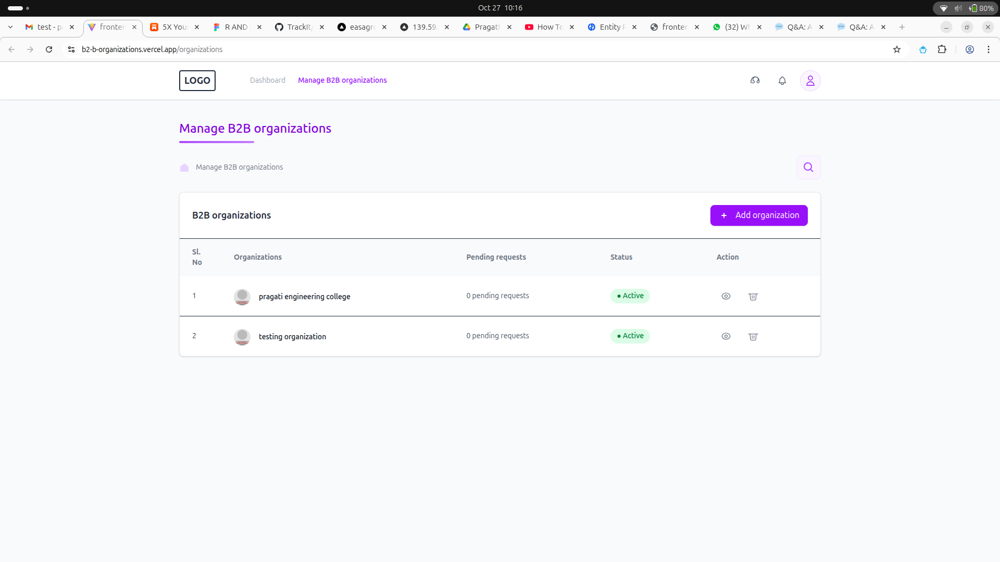

# B2B Organizations Management System

A comprehensive web application for managing B2B organizations and their users. This system provides a clean, intuitive interface for organization administrators to manage their organizational structure, user roles, and settings.

## Screenshots




## Features

### Organization Management
- **Organization Listing**: View all B2B organizations in a structured table format
- **Organization Details**: Comprehensive organization profile management
- **Add Organizations**: Create new organizations with detailed information
- **Organization Status**: Track and manage organization status (Active, Blocked, Inactive)
- **Delete Organizations**: Remove organizations with confirmation dialogs

### User Management
- **User Listing**: View all users within an organization
- **Add Users**: Add new users with specific roles (Admin, Co-ordinator, User)
- **Role Management**: Assign and manage user roles with visual badges
- **User Deletion**: Remove users from organizations

### Organization Profile
- **Basic Details**: Organization name, SLUG, contact information
- **Contact Management**: Primary admin email and phone number
- **Settings Configuration**: 
  - Maximum allowed coordinators
  - Timezone settings (common name and region)
  - Language preferences
  - Official website URL

### User Interface
- **Responsive Design**: Mobile-friendly interface using Tailwind CSS
- **Navigation**: Clickable logo navigation to organizations page
- **Breadcrumb Navigation**: Clear navigation hierarchy
- **Status Indicators**: Visual status pills for organizations and users
- **Interactive Elements**: Hover effects and smooth transitions

## Technology Stack

### Frontend
- **React 18** with TypeScript
- **React Router** for navigation
- **Tailwind CSS** for styling
- **Vite** for build tooling

### Backend
- **Node.js** with TypeScript
- **Express.js** for REST API framework
- REST API hosted at `https://b2b-organizations.onrender.com`
- Endpoints for organizations and users CRUD operations

## Project Structure

```
Frontend/
├── src/
│   ├── pages/
│   │   ├── ManageB2BOrganizations.tsx    # Main organizations listing page
│   │   └── OrganizationDetailsPage.tsx   # Organization details and user management
│   ├── components/
│   │   ├── AddOrganizationSidebar.tsx    # Sidebar for adding organizations
│   │   ├── AddUserSidebar.tsx            # Sidebar for adding users
│   │   └── OrganizationDetails.tsx       # Organization details component
│   └── ...
```

## Key Components

### ManageB2BOrganizations
- Main dashboard for viewing all organizations
- Add new organizations functionality
- Organization status management
- Navigation to organization details

### OrganizationDetailsPage
- Tabbed interface (Basic Details, Users)
- Organization profile management
- User management within organizations
- Role-based user display with color-coded badges

## API Integration

### Organizations Endpoints
- `GET /api/organizations` - Fetch all organizations
- `POST /api/organizations` - Create new organization
- `GET /api/organizations/:id` - Get organization details
- `DELETE /api/organizations/:id` - Delete organization

### Users Endpoints
- `GET /api/organizations/:id/users` - Get users for organization
- `POST /api/organizations/:id/users` - Add user to organization
- `DELETE /api/users/:id` - Delete user

## User Roles

- **Admin**: Full administrative access (Green badge)
- **Co-ordinator**: Coordination responsibilities (Orange badge)
- **User**: Standard user access (Blue badge)

## Navigation Features

- **Clickable Logo**: Logo in header navigates to organizations page
- **Breadcrumb Navigation**: Shows current page hierarchy
- **Status Management**: Visual indicators for organization status
- **Responsive Header**: Support and notification icons with user avatar

## Getting Started

1. Clone the repository
2. Install dependencies: `npm install`
3. Start development server: `npm run dev`
4. Navigate to the application in your browser

## Usage

1. **View Organizations**: Main page displays all B2B organizations
2. **Add Organization**: Click "Add organization" button to create new organizations
3. **View Details**: Click the view icon to see organization details
4. **Manage Users**: Switch to "Users" tab to manage organization members
5. **Add Users**: Use "Add user" button to invite new members
6. **Navigate**: Click logo to return to organizations list
